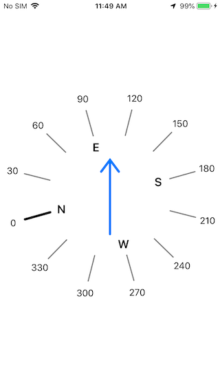

# GSBCompassViewApp



This is a simple wrapper app to showcase the core GSBCompassView class, a custom Swift UIView class to draw a circular compass aligned to the device's builtin compass. As you rotate your phone the compass will refresh accordingly. The compass rendering code is written entirely using CoreGraphics and is quite responsive even on an iPhone 4S. The code runs has been tested on iOS 9.3 thru iOS 14.2.

The GSBCompassView resizes itself appropriately to fit its bounds (centered), and supports changing the device orientation between portrait and landscape, which requires flipping the compass' pointing direction so that it remains aligned to the physical hardware. But if you want to display the compass within a very small subview then you might want to reduce the font size used to draw the degrees (```degreeFontSize```) and cardinal compass directions (```cardinalFontSize```). You can also change the number of compass directions to display (```segments```); if this is divisible by 4 then the four cardinal directions - "N", "S", "E", "W" - will also be displayed

To use in your own app just add a GSBCompassView subview to your UIViewController, setup a CLLocationManagerDelegate and update the GSBCompassView.compassDegress heading in your -locationManager:didUpdateHeading: delegate method, and finally call setNeedsDisplay() to redraw the compass. See the ViewController.swift file for an example. Note: you will have to add [NSLocationWhenInUseUsageDescription](https://developer.apple.com/documentation/bundleresources/information_property_list/nslocationwheninuseusagedescription) to your Info.plist file to request access to the CLLocationManager API services.
